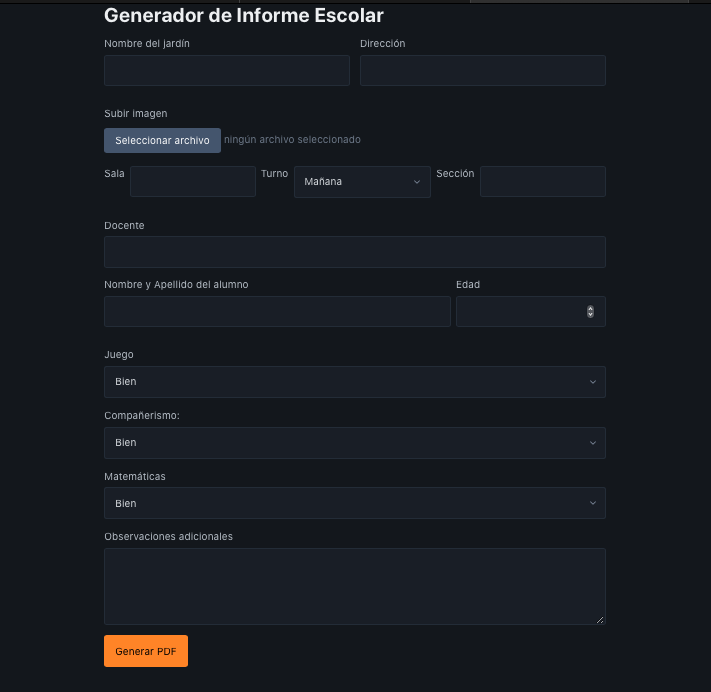

# 📝 Generador de Informe Escolar

Este proyecto es un generador de informes escolares, diseñado para facilitar la creación y personalización de informes en formato PDF para estudiantes de nivel inicial. La aplicación, creada con HTML, CSS y JavaScript, permite a los docentes generar informes personalizados de manera eficiente y profesional.

## 🎯 Objetivo del Proyecto

El **Generador de Informe Escolar** surge de la necesidad de simplificar y optimizar el tiempo de los docentes al crear evaluaciones de estudiantes. Sabemos lo demandante que puede ser preparar informes escritos a mano, por lo que este proyecto ofrece una solución rápida y fácil de usar.

## 🚀 Características Principales

- **Campos Personalizables**: Incluye opciones para ingresar el nombre del estudiante, datos de la sala, sección, y más.
- **Selección de Desempeño**: Los docentes pueden evaluar al alumno en diferentes áreas, eligiendo entre "Bien" o "Mal" y generar automáticamente el texto correspondiente.
- **Espacio para Observaciones Adicionales**: Permite agregar notas o comentarios personalizados.
- **Generación de PDF**: Exporta el informe directamente a un archivo PDF con un formato limpio y profesional.
- **Subida de Imagen**: Opción para incluir una imagen del jardín en la esquina superior izquierda del informe.

## 🛠️ Cómo Usar

1. **Completa los Campos**: Rellena la información del jardín, docente, y estudiante en el formulario.
2. **Selecciona Desempeños**: Elige "Bien" o "Mal" en las áreas evaluadas (Juego, Compañerismo, Matemáticas).
3. **Observaciones Adicionales**: Agrega comentarios personalizados si es necesario.
4. **Sube una Imagen (Opcional)**: Añade un logo o imagen relevante.
5. **Genera el PDF**: Haz clic en el botón "Generar PDF" y descarga el informe personalizado.

## ⚙️ Requisitos Técnicos

Este proyecto utiliza la librería [jsPDF](https://github.com/parallax/jsPDF) para la creación de archivos PDF. No se requieren dependencias adicionales, ya que todo el código se ejecuta en el navegador.

## 🎨 Vista del Proyecto

## 📚 Tecnologías Utilizadas

- **HTML5**: Para la estructura del formulario y la interfaz.
- **CSS3 y PicoCss**: Para el diseño básico y la disposición de los elementos.
- **JavaScript**: Lógica del proyecto y generación de archivos PDF.

## 💡 ¿Por Qué Este Proyecto?

Como desarrollador, me apasiona crear herramientas que marquen una diferencia real en la vida cotidiana de las personas. Este proyecto es una forma de apoyar a los docentes, haciendo que la creación de informes escolares sea más rápida, precisa y menos estresante.

## 🤝 Contribuciones

¡Contribuciones, sugerencias y mejoras son siempre bienvenidas! Si deseas contribuir:

1. Haz un fork de este repositorio.
2. Crea una rama nueva (`git checkout -b feature-nueva`).
3. Realiza tus cambios y haz un commit (`git commit -m 'Añadir nueva característica'`).
4. Envía tu rama (`git push origin feature-nueva`).
5. Abre un Pull Request.

## 📜 Licencia

Este proyecto está bajo la licencia MIT. Puedes usarlo y modificarlo libremente para tus necesidades.

---

Gracias por visitar el proyecto. ¡Espero que esta herramienta sea de gran ayuda para docentes y estudiantes por igual!

